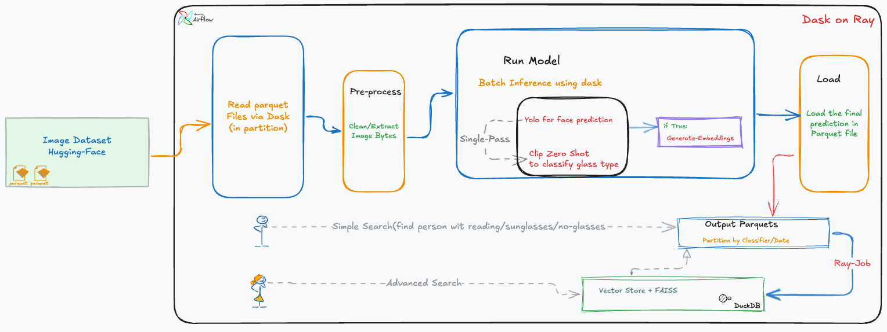

# Image Eyeglass Detection Pipeline

### PS
- 🚀 **Dask, Ray** are our distributed superheroes for data processing!
- 🖥️ **Running Locally?** Remember, we’re not in full driver-worker mode here, so stick with a smaller dataset for smooth sailing. (Refer image_filter_pipeline/config.py&settings.py)
- ⚡ **Shortcut Alert!** You could load data into **Pandas** file by file and loop through it for faster local processing—but that’s not the distributed or production-grade way.
- 📈 **Geek Out with Dask Dashboard!** Dive in to monitor memory usage and track stage progress like a pro.
- 📚 **How to Run**: For detailed instructions, refer to the **README.md** inside.
- 📓 **Query**: Check out our Jupyter Notebook (`notebooks/search_query_dask_sql.ipynb`) for a straightforward example. For more details, refer to the juapreciptrack/README.md file inside.
- ⏱️ **Local Run Time** Processing 2 Parquet files, including creating output file, takes approximately 4 minutes. (8GB of RAM, 4 workers with 2 thread)
- Please Note : For saving some time I have predownloaded those file to save time doing downloading again and again , but added steps/checks in Makefile to download if not present

Output-Datasets are available here : https://huggingface.co/datasets/jhabikash2829/face-glasses-inference-v1/tree/main

<!-- TOC -->
* [Image Eyeglass Detection Pipeline](#image-eyeglass-detection-pipeline)
    * [PS](#ps)
  * [Overview](#overview)
  * [Data Source](#data-source)
  * [Architecture](#architecture-)
    * [Pipeline Flow](#pipeline-flow)
    * [Key Features](#key-features)
  * [Considerations:](#considerations)
    * [**Framework Choice: Dask & Ray vs. Spark (Depends of institutional knowledge which one to choose)**](#framework-choice-dask--ray-vs-spark-depends-of-institutional-knowledge-which-one-to-choose-)
  * [👉 **Takeaway**: After evaluating Spark, Dask, and Ray, we opted for a Python-native solution. While Spark is mature for ETL and structured workloads, its overhead makes it less appealing for deep learning and image processing tasks. Dask provides straightforward parallelization of image operations and PyTorch models, aligning closely with our needs. We complement Dask with **Ray** in scenarios where tasks cannot be efficiently parallelized by Dask alone.](#-takeaway-after-evaluating-spark-dask-and-ray-we-opted-for-a-python-native-solution-while-spark-is-mature-for-etl-and-structured-workloads-its-overhead-makes-it-less-appealing-for-deep-learning-and-image-processing-tasks-dask-provides-straightforward-parallelization-of-image-operations-and-pytorch-models-aligning-closely-with-our-needs-we-complement-dask-with-ray-in-scenarios-where-tasks-cannot-be-efficiently-parallelized-by-dask-alone)
    * [**Dask on Coiled vs. Ray**](#dask-on-coiled-vs-ray-)
    * [**Deployment: Kubernetes vs. Cloud Providers**](#deployment-kubernetes-vs-cloud-providers-)
    * [**Single-Pass vs. Multiple-Pass Inference (YOLO + CLIP)**](#single-pass-vs-multiple-pass-inference-yolo--clip-)
  * [Models consideration](#models-consideration-)
  * [**Custom Model vs. YOLO + CLIP: Trade-offs**](#custom-model-vs-yolo--clip-trade-offs-)
    * [**Why YOLO + CLIP?**](#why-yolo--clip-)
      * [**Trade-offs**](#trade-offs-)
    * [**What a Custom Model Could Solve**](#what-a-custom-model-could-solve-)
    * [**Final Take**](#final-take-)
  * [Deployment & Monitoring](#deployment--monitoring)
    * [Pipeline Monitoring (Grafana & Prometheus):](#pipeline-monitoring-grafana--prometheus-)
    * [Model Validation Monitoring:](#model-validation-monitoring)
  * [Future Improvements](#future-improvements)
<!-- TOC -->

## Overview

This project aims to build a scalable and efficient image filtering pipeline to help researchers quickly identify images based on specific criteria. 
The primary objective is to curate a dataset containing images of individuals wearing eyeglasses (excluding sunglasses), ensuring that the faces are clearly visible and at least 100×100 pixels in size.

## Data Source

We use the **WIT (Wikipedia Image Text) dataset**—specifically `train-00000-of-00330.parquet` and `train-00001-of-00330.parquet`—to extract metadata and image URLs. A Makefile checks for and downloads the files if needed.  
More details can be found at [WIT on Hugging Face](https://huggingface.co/datasets/wikimedia/wit_base).

## Architecture 

Note: Due to time constraints, not every piece made it into the final solution. For example, the orchestration pipeline with Airflow and the advanced search using DuckDB and FAISS are still on the wishlist.  
The attached Jupyter Notebook demonstrates a simple search case, while I envisioned covering more advanced scenarios.

---

### Pipeline Flow

1. **Data Ingestion**  
   - **Parquet on Dask**: Grab partitioned files (e.g., `train-00000-of-00330.parquet`) from Hugging Face, parallelized for scale.  
   - **Plug into Ray**: Leverage Ray to parralize task which cant be done via Dask in parallel way .

2. **Preprocessing**  
   - **Clean & Extract**: Convert image URLs into bytes, dismiss invalid entries, and resize images—everything you need for a smooth next step.  

3. **One-Pass Inference**  
   - **YOLO Face Detection**: Quickly scope out faces with bounding boxes and confidence.  
   - **CLIP Zero-Shot**: Classify whether those faces sport reading glasses, sunglasses, or no glasses—all in a single pass.  
   - **Optional Embeddings**: (Flag-Based) Generate embeddings for faces meeting certain criteria, setting the stage for deeper analysis.
    **Summary** : The pipeline uses YOLO to first locate person(s) in the image, then applies CLIP (with appropriate text prompts or embedding comparison) to determine 
if those persons are wearing regular eyeglasses (as opposed to sunglasses or no glasses)

4. **Output & Partitioning**  
   - **Parquet Exports**: Store final predictions and embeddings in partitioned Parquet files by classifier or date.  
   - **Flexible Load**: Pass data on to other systems—like Ray for further processing or direct analysis by the team.

5. **Search & Analysis**  
   - **Simple Search**: Quickly filter who’s wearing what via Parquet queries.  
   - **Advanced Search (Wishlist)**: Merge DuckDB + FAISS for high-speed vector lookups and structured analysis. (Smaller version of FAISS is part of my submision)

---

### Key Features

- **Single-Pass Power**: Detect faces and classify glasses in a single workflow—no needless loops.  
- **Built for Scale**: Dask and Ray integrations let you handle massive datasets effortlessly.  
- **Partitioned Magic**: Organized Parquet outputs keep queries fast and focused.  
- **Ready to Expand**: Airflow/Dagster for orchestration, DuckDB/Vector Store for querying, and FAISS for vector search without re-architecting everything.

## Considerations:

---

### **Framework Choice: Dask & Ray vs. Spark (Depends of institutional knowledge which one to choose)**  
- **Spark**: Excellent for structured and SQL-like data processing but not well-suited for image-based workflows (YOLO, CLIP, OpenCV), primarily due to its dataframe-centric approach and limited native GPU support.
  
- **Dask**: Naturally handles multi-dimensional data (like images and tensors) and integrates seamlessly with Python libraries such as NumPy, OpenCV, and Pillow, making it ideal for our inference pipeline.

👉 **Takeaway**: After evaluating Spark, Dask, and Ray, we opted for a Python-native solution. While Spark is mature for ETL and structured workloads, its overhead makes it less appealing for deep learning and image processing tasks. Dask provides straightforward parallelization of image operations and PyTorch models, aligning closely with our needs. We complement Dask with **Ray** in scenarios where tasks cannot be efficiently parallelized by Dask alone.
---

### **Dask on Coiled vs. Ray**  
- **Coiled** simplifies Dask deployments but **can be expensive** for high-memory workloads.  
- **Ray** offers **better cost control**, but requires **more setup and tuning**.  

👉 **Takeaway**: If cost is a concern and **you already know how to run Dask on Kubernetes**, **skip Coiled** and manage your own clusters.  

---

### **Deployment: Kubernetes vs. Cloud Providers**  
- **Kubernetes** (Dask/Ray Operator) → **Cheaper long-term**, great for GPU scaling, but requires management.  
- **Crusoe Cloud** → **Cheaper inference** but **high egress costs**; limited storage.  
- **GCP/AWS** → Easier to manage, but **can get costly with bandwidth/storage fees**.  

👉 **Takeaway**: **Kubernetes + GPUs** is the best balance if you have expertise. Otherwise, **managed cloud services may be worth the trade-off.**  

---

### **Single-Pass vs. Multiple-Pass Inference (YOLO + CLIP)**  
- **Single-Pass (YOLO + CLIP together)**  
In a single-pass pipeline, each image is loaded once, and the pipeline performs all necessary computations (detection + embedding) in one go, then moves on. 
 This has practical performance benefits: loading and decoding images can be a bottleneck, so it’s optimal to do it only one time per image. 
 In our case, as soon as an image is loaded, the worker runs YOLO to find persons; if no person is detected, we can immediately skip the CLIP step or mark the image as not relevant. 
 If a person is detected, the same process continues to run CLIP on that image (e.g. on the whole image or cropped person region) to check for eyeglasses. 
 The results (person found or not, eyeglasses found or not, plus the CLIP vector) are then emitted. 
 

- **Multiple-Pass (YOLO, then CLIP separately)**  
In a multi-pass approach, 
 we would have done this in stages – e.g., first run a batch job over all images to detect persons and save those results, 
then run a second job to classify eyeglasses only on images that had people. 
While multi-pass can avoid some unnecessary computations, it introduces overheads in writing intermediate data and complicates the pipeline. 
We opted for the simpler single-pass design to minimize data movement and I/O. This means some images that have no people still incur a (quick) CLIP embedding generation,
but the cost was minor compared to the simplicity gained. Moreover, combining the models in one pass allowed us to take advantage of 
pipeline parallelism on each worker (the image resides in memory and can flow through both models sequentially without extra communication).  

👉 **Takeaway**: **Single-pass wins here for my assignment**—it avoids unnecessary reprocessing and keeps things lean. **Push down predicates**.
                  **But in production I might chose Multiple-Pass**

## Models consideration 
## **Custom Model vs. YOLO + CLIP: Trade-offs**  

Since no **custom model** exists for our use case, we rely on **YOLO for face detection** and **CLIP (zero-shot) for glasses classification**. 
While this works, a **single model** that detects faces *and* classifies glasses in one pass would be ideal. 

### **Why YOLO + CLIP?**  
✅ **No Need for Custom Training** – CLIP classifies glasses without labeled data.  
✅ **Flexible & Adaptable** – Works out of the box for various glass types.  
#### **Trade-offs** 
❌ **Two-Step Inference** – YOLO detects faces, then CLIP classifies, adding processing overhead.  
❌ **Model Mismatch** – Separate models weren’t trained together, potentially leading to inconsistencies.  

### **What a Custom Model Could Solve**  
✅ **Faster Inference** – Detect faces + classify glasses in **one pass**, reducing overhead.  
✅ **Optimized for Our Data** – A trained model would be **more accurate** than zero-shot methods.  

### **Final Take**  
For now, **YOLO + CLIP is our best option**—it provides a **workable, flexible solution** without needing costly custom training. However, if inference speed becomes a bottleneck, **a future custom model could streamline the process**. 🚀

## Deployment & Monitoring

### Pipeline Monitoring (Grafana & Prometheus): 
Once deployed, we monitor the system’s performance and health using Prometheus and Grafana. Both Dask and Ray expose metrics about task execution, resource utilization, and throughput. 

### Model Validation Monitoring:
In addition to infrastructure monitoring, we also track the ML model's performance to ensure YOLO and CLIP continue delivering accurate results. 
Industry-standard tools like **Weights & Biases (W&B)** or **MLflow** help log experiments and monitor key metrics over time. 
For instance, using a small labeled dataset of images with known eyeglass labels, we regularly compute and log metrics such as **precision**, **recall**, and **F1-score** after each pipeline run. 
This approach helps us quickly detect any performance drift and maintain consistent, high-quality results.

## Future Improvements
- **Orchestration**: Add **Airflow/Dagster** for managing workflow complexity.
- **Vector Database for Embeddings** : Use dedicated could solution for vector databases 
- **Unified Model (YOLO + CLIP Combined)** : Develop or adopt a single custom model combining YOLO and CLIP capabilities.
